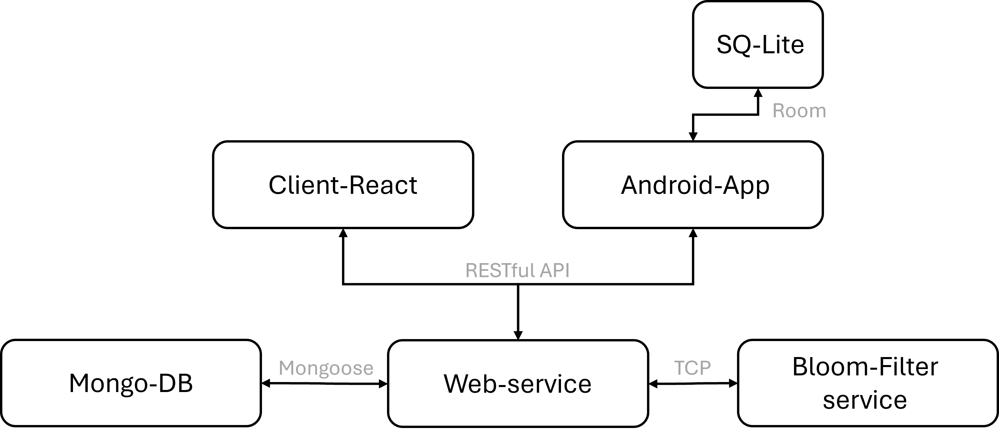

# NewsPhere - Full Stack Social Platform

NewsPhere is a Facebook-style social network clone built with a modular architecture. It includes:
- A RESTful Node.js backend connected to MongoDB
- A React-based web client
- An Android mobile app (NewsSphere)
- A C++ microservice for detecting malicious links using a Bloom filter

This monorepo unifies all components for streamlined development and deployment.

---

## Project Structure

```
NewsPhere/
├── web-service/        # Node.js backend connected to MongoDB
├── client-react/       # React web application
├── android-app/        # Android app (NewsSphere)
├── filter-service/     # C++ TCP server with Bloom filter logic
├── docs/               # Markdown-based documentation
└── scripts/            # Setup and helper scripts
```

---

## Quick Start

### 1. Clone the Monorepo

```bash
git clone https://github.com/Sapir-Bar/NewsPhere.git
cd NewsPhere
```

### 2. Install Prerequisites

- **Node.js** (for backend + React)
- **MongoDB** (local or Docker)
- **Android Studio** (to run the mobile app)
- **g++ / CMake** (for the Bloom filter service)

---

## MongoDB Initialization

Before running the backend, ensure MongoDB is running and contains the required data:

### 1. Start MongoDB

```bash
mongod
```

### 2. Import Initial Data

In a separate terminal:

```bash
mongoimport --db newsphere --collection users --file web-service/users.json --jsonArray
mongoimport --db newsphere --collection posts --file web-service/posts.json --jsonArray
```

> The files `posts.json` and `users.json` are located in `web-service/`.
---

## Run the Services

### Web Service

```bash
cd web-service
npm install
npm start
```

> Runs on port `12345` by default (configurable in the `config/` directory)

### React Frontend

```bash
cd client-react
npm install
npm start
```

> Open [http://localhost:3000](http://localhost:3000) in your browser.

### Android App

Open `android-app/` in Android Studio and run on a virtual or real device. The app also uses **local SQLite storage**.

### Bloom Filter TCP Server

```bash
cd filter-service
g++ ./*.cpp -o bloom_filter_server -pthread
./bloom_filter_server
```

---

## Architecture Diagram



---

## Documentation

- [Workspace Setup Guide](docs/settingUpWorkSpace.md)
- [React App Features](docs/react.md)
- [Android App Guide](docs/android_application.md)

---

## Security Feature: Malicious Link Filter

All posts (on web and mobile) are scanned through a Bloom filter microservice to prevent spreading harmful content.

---

## Tech Stack

| Layer        | Technology                     |
|--------------|--------------------------------|
| Frontend     | React.js                       |
| Mobile       | Java (Android, Android Studio) |
| Backend      | Node.js + Express              |
| Database     | MongoDB + Mongoose             |
| Local Storage| SQLite (mobile only)           |
| Security     | C++ Bloom Filter TCP Server    |
