# React 

## Table of Contents
1. [Login_and_registration](#Login_and_registration)
2. [Editing_and_Creating_posts:](#Editing_and_Creating_posts:)
3. [Creating_posts](#Creating_posts)
4. [Features_of_posts](#Features_of_posts)
5. [friends](#friends)

## Login and registration
The first screen you will see will be the login screen, if you have a user enter your name and password
If you do not have a user, go to the login screen using the relevant button
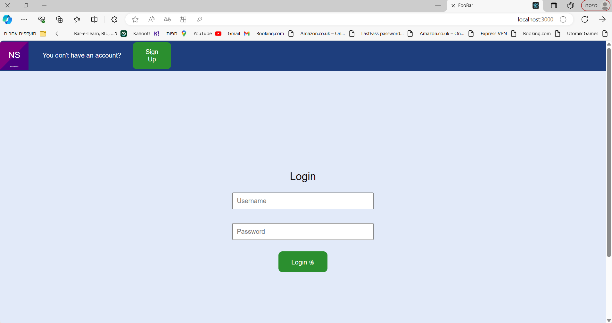
This is the login screen, you must fill in all the details including a picture
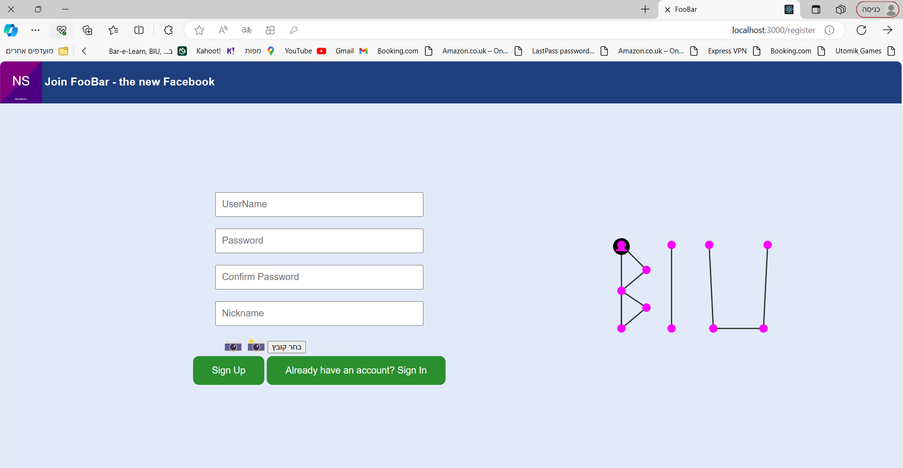
You can choose any image you have on your computer
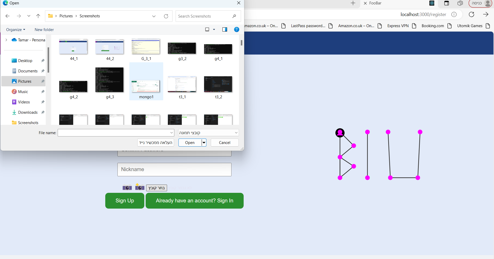
If you do not fill in one of the fields in the correct format, you will receive an appropriate error message on the screen
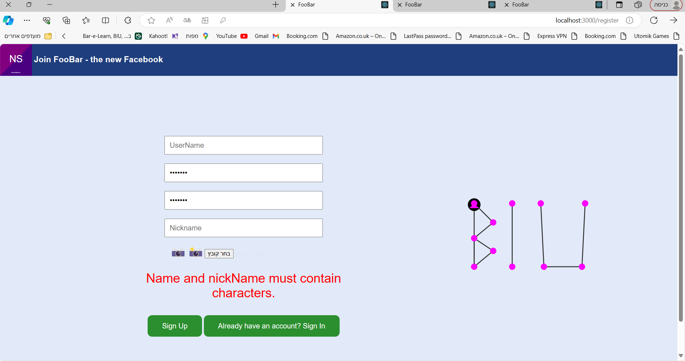
When you're done, you'll go to the login screen, where you'll enter the user information you just created
### Editing_and_Creating_posts: 
You have now entered the feed page

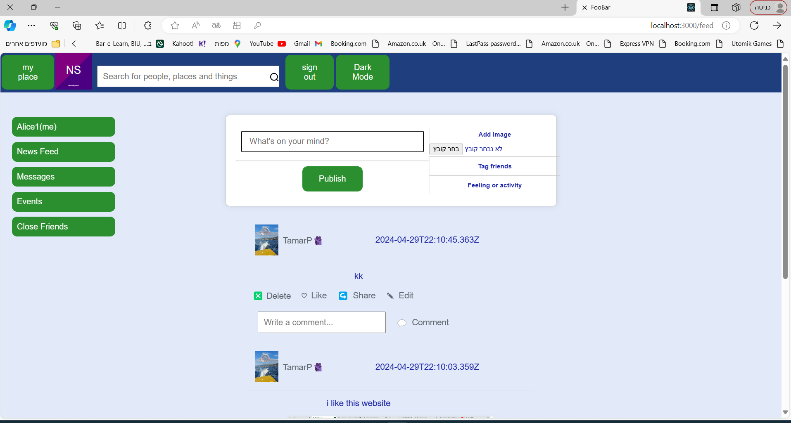

You can add text and image for a new post

You can see the post displayed in the feed

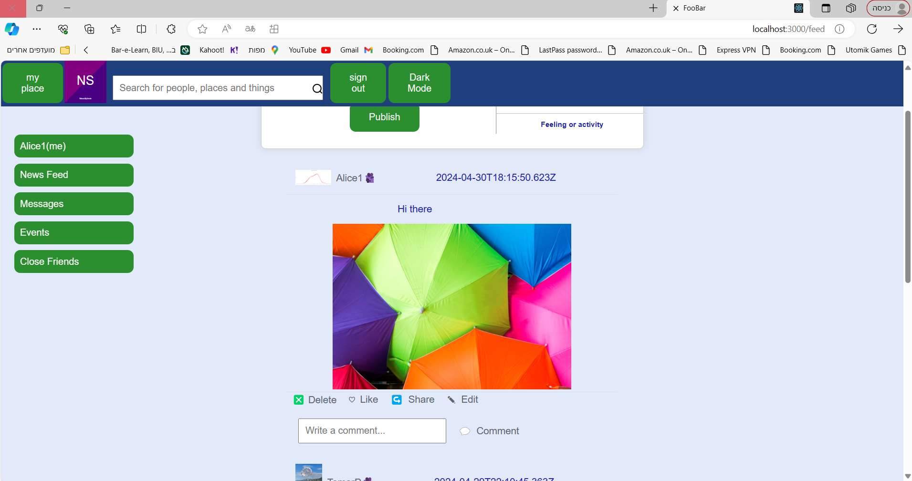

You can edit the post, the text and the image:

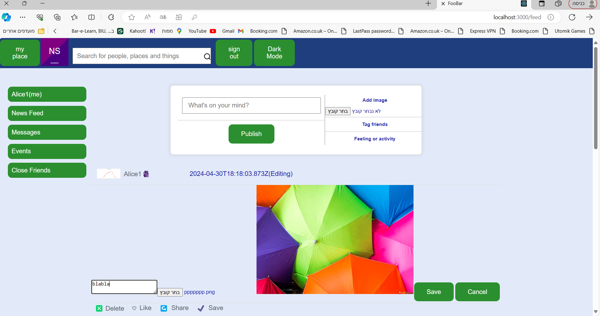

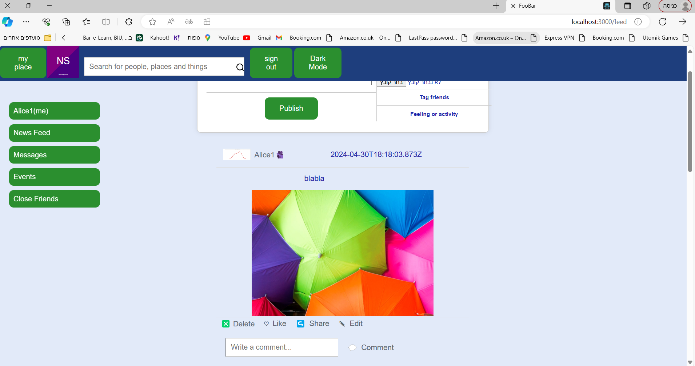

You can edit the post, the text and the image: 

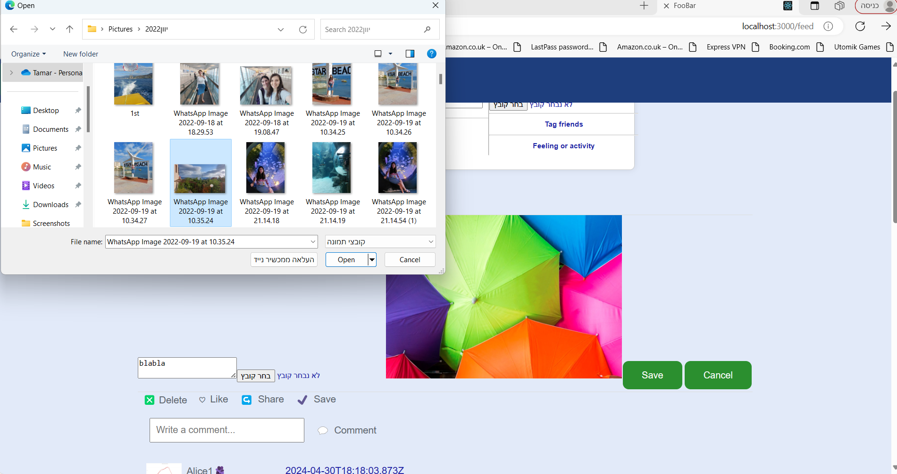

## Features_of_posts
You can also switch to a black screen by pressing the appropriate button on the upper part

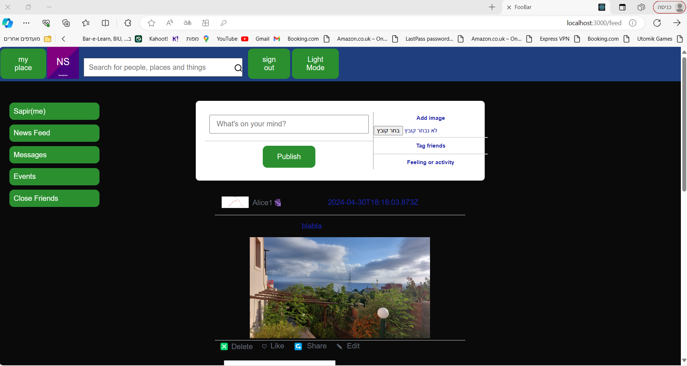

You can also like and add comments

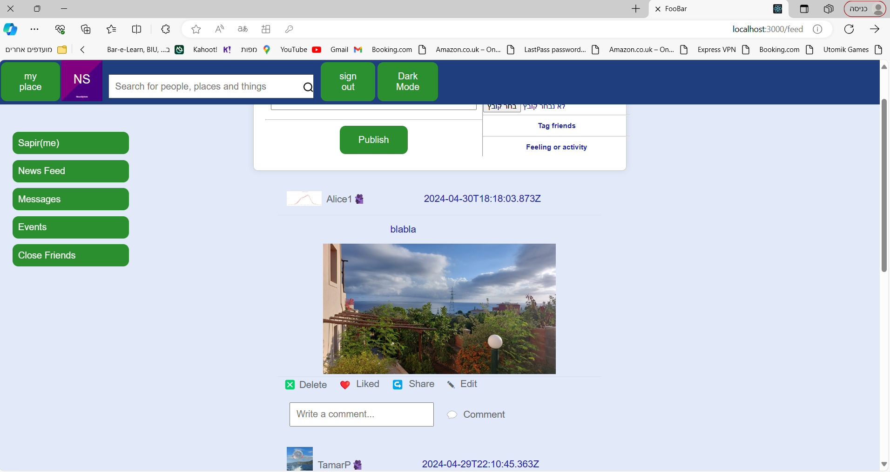

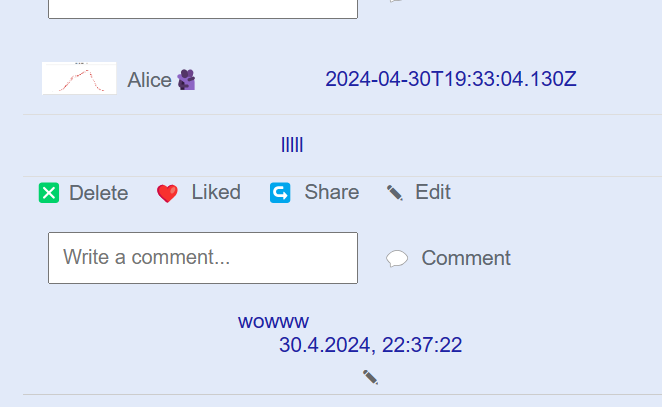

## friends
To enter a person's page you will find his post and click on his name

For example here I scrolled to the end of the feed and clicked on TamarP
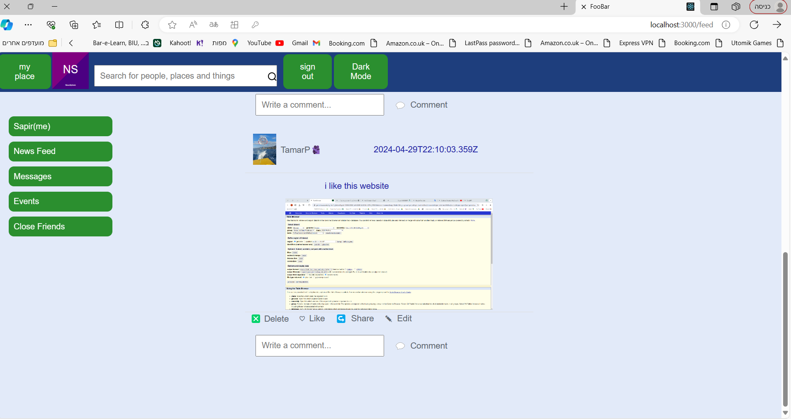

I came to her page but I am not her friend

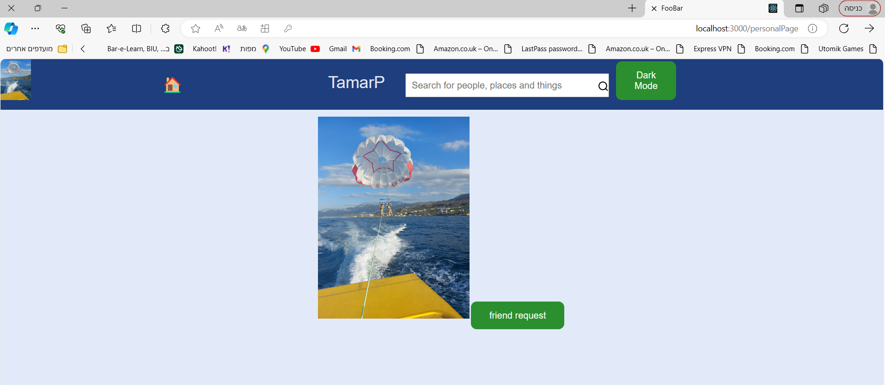

I suggested friendship and when she approved I can see her posts on my next login

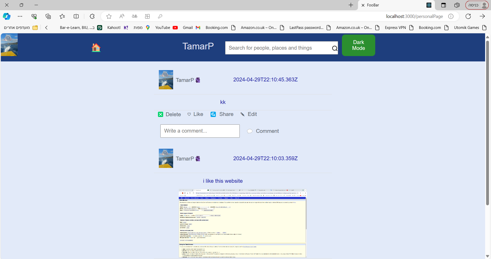

I can't edit her posts

### Response_to_malicious_links
A post with a malicious link cannot be updated

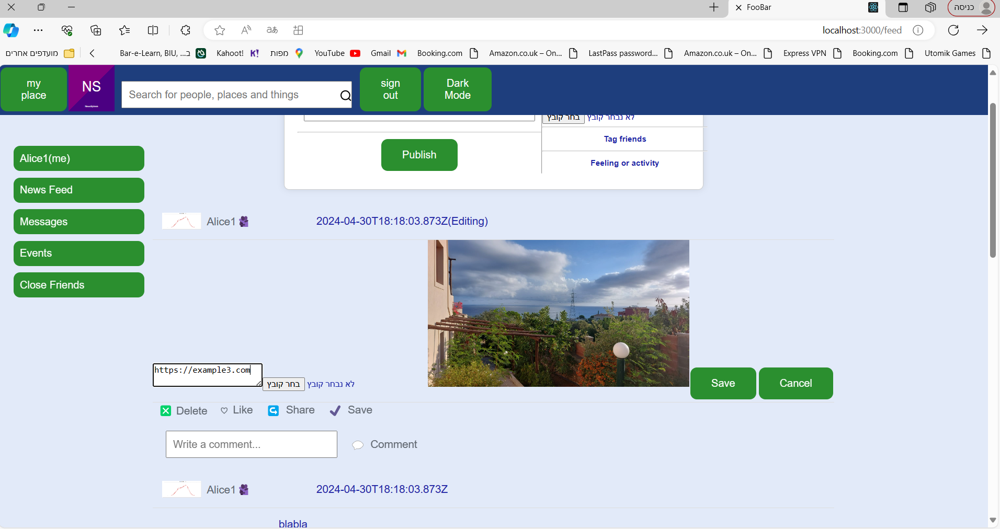

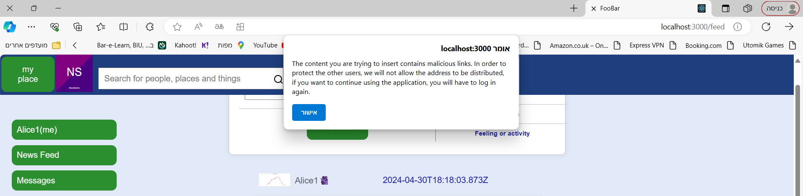

It is not possible to upload a post with a malicious link

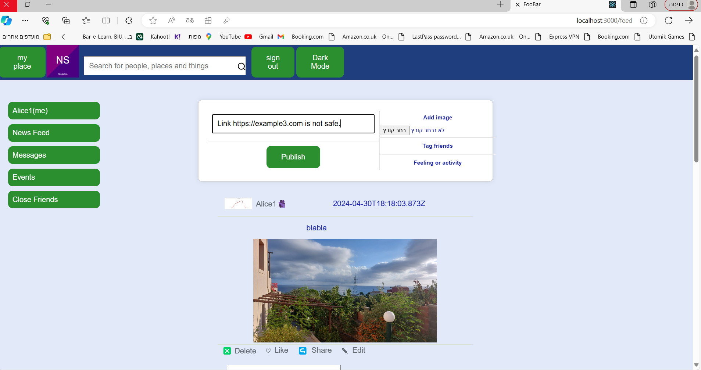

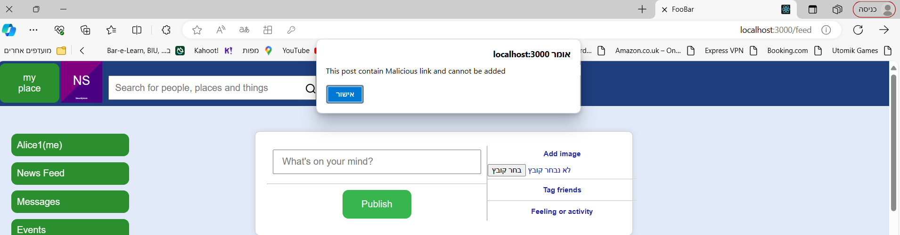

### my place

Login by clicking on my place

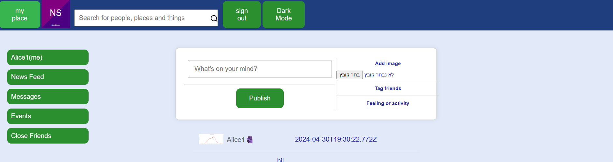

the personal area

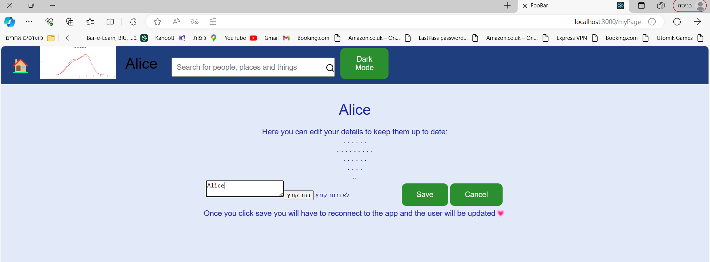

The name is changed accordingly

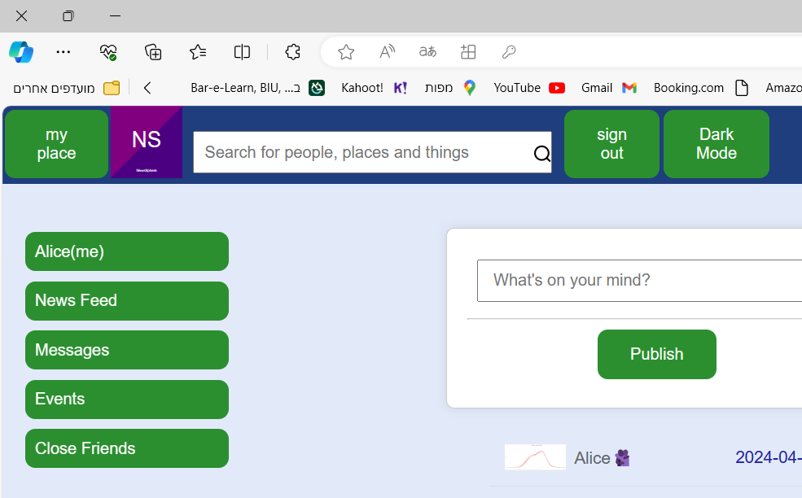