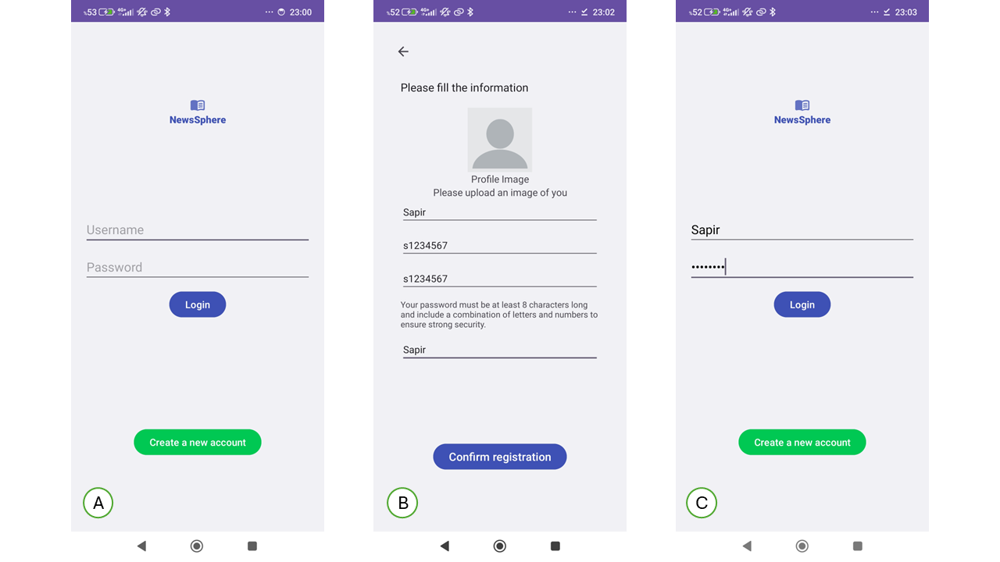
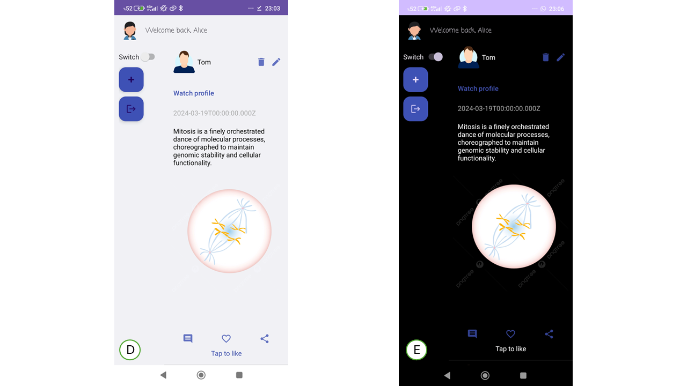
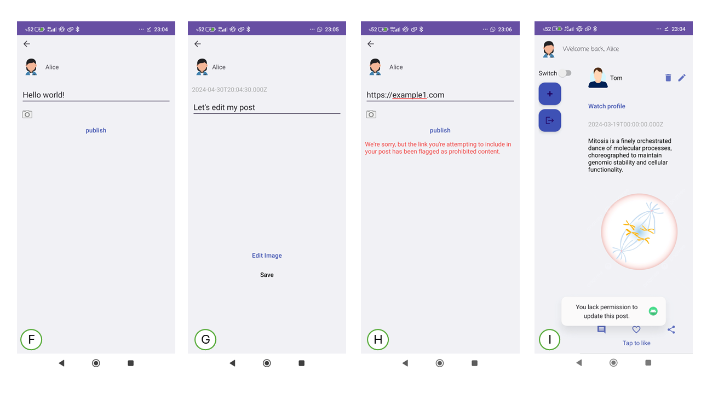
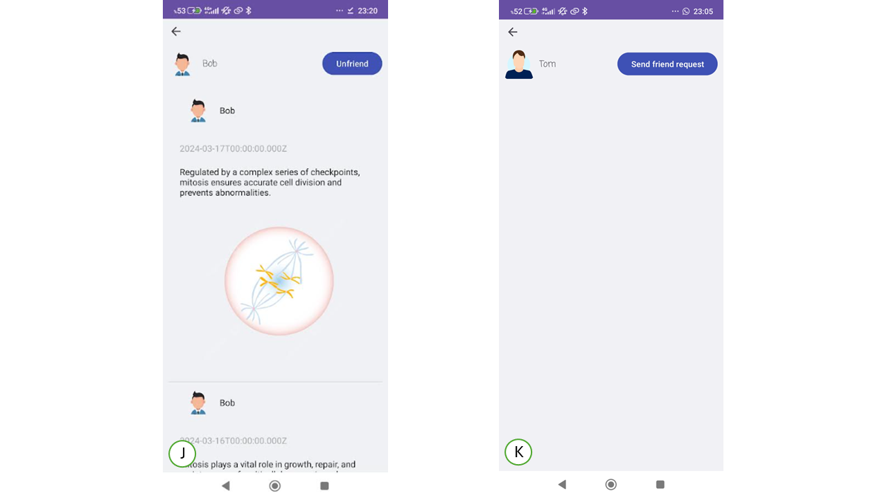

# NewsSphere

Welcome to NewsSphere! NewsSphere is an Android application that functions as a social network designed for sharing articles.

## Table of Contents
1. [Prerequisites](#prerequisites)
2. [Clone the Repository](#clone-the-repository)
3. [Running the Application](#running-the-application)
4. [Features](#features)
5. [Jira](#jira)

## Prerequisites
Before getting started with NewsSphere, make sure your development environment is set up correctly:

- [Android Studio](https://developer.android.com/studio) is installed on your computer.
- [Git](https://git-scm.com/) is installed for cloning the project locally.

## Clone the Repository
You can clone the NewsSphere repository using Android Studio or manually via Git Bash:

### Using Android Studio:
1. Launch Android Studio.
2. Select "Get from Version Control" and paste the repository URL: `https://github.com/Sapir-Bar/Android-Application.git`

### Using Git Bash:
```bash
git clone https://github.com/Sapir-Bar/Android-Application.git
```

## Running the Application
To run NewsSphere and test its features, follow these steps:

1. Create a virtual device using the Android Virtual Device (AVD) Manager in Android Studio. Alternatively, connect an existing device via Wi-Fi/USB.
2. Click the "play" button in Android Studio to start the emulator.
3. Launch NewsSphere on the emulator to explore its functionality.

## Features

# Registration and Login 



Please follow the next steps in order to use the app:

A - The first screen is the login screen. Please click on 'Create a new account'.

B - Please fill in all fields according to the instructions. *The choice to upload a profile picture is according to the user's preference. 

C - Once registration is complete, please proceed to log in using the username and password you provided during registration.

# Home Screen



D - On the home screen, you will see 20 posts from your friends and an additional 5 posts from users who are not on your friends list.

E - Night mode option for your choise. 

# Create and edit personal content



F - Create post screen. Feel free to share your thoughts.

G - Edit post screen. 

H - Our app prevent uploading a malicious links. please notice. 

I - You can edit and delete content created by yourself only.

# Watch Users profiles



J - You can view the profiles of your friends.

K - To view the profiles of users who are not in your friends list, please send them a friend request.